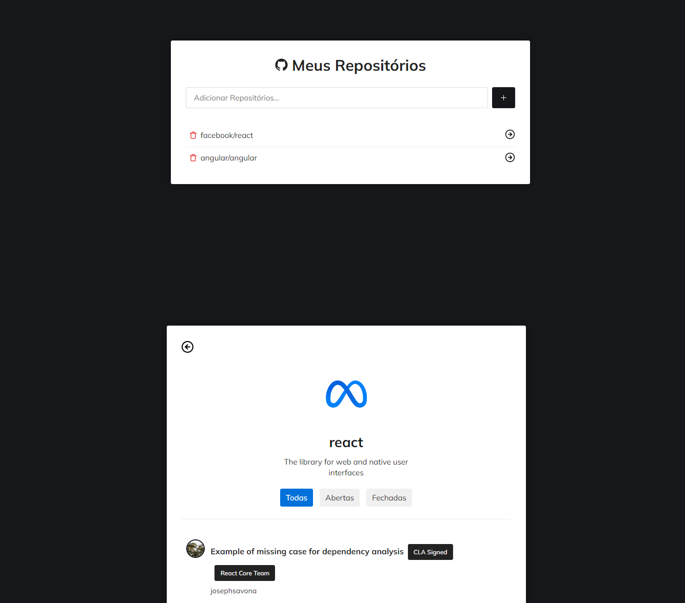

<a name="readme-top"></a>

<div align="center">

[![MIT License][license-shield]][license-url]
[![Version][version-shield]][version-shield]

</div>

<br />
<div align="center">
    <a href="https://github.com/joaosouza7/repos">
    
    </a>
    <br />
    <br />

  <h3 align="center">Projeto Repos</h3>

  <p align="center">
    Favorite e veja os detalhes dos seus repositórios favoritos
    <br />
    <a href="https://github.com/joaosouza7/repos"><strong>Explore o documento »</strong></a>
    <br />
    <br />
    <a href="#sobre">Sobre</a> • 
    <a href="#tecnologias">Tecnologias</a> • 
    <a href="#preview">Preview</a> • 
    <a href="#como-executar">Como executar?</a> • 
    <a href="#licenca">Licença</a> •
    <a href="#contato">Contato</a>
  </p>
</div>

<!--Sobre o Projeto-->
<h2 id="sobre">💻 Sobre o projeto</h2>

Projeto Repos - é um aplicativo React simples que permite ao usuário buscar e salvar seus repositórios favoritos no **Local Storage** do navegador. Os dados são obtidos com auxílio da API gratuita do [Github](https://github.com/). Além disso, é possível vizualizar os detalhes dos repositórios salvos.

<!--Tecnologias-->
<h2 id="tecnologias">🛠 Tecnologias utilizadas</h2>

As seguintes ferramentas foram utilizadas no desenvolvimento do projeto.

* [React][react-url]
* [React Icons][reacticons-url]
* [Axios][axios-url]

<!--Preview do projeto-->
<h2 id="preview">🔎 Preview do projeto</h2>

<div align="center">
  
</div>

<!--Como executar-->
<h2 id="como-executar">🚀 Como executar o projeto?</h2>

### Pré-requisitos

Antes de começar, certifique-se de ter instalado em sua máquina as seguintes ferramentas:
[Git][git-url], [Node][node-url]. 
Além disso, é bom ter um editor para trabalhar com o código como o [VSCode][vscode-url].

### 🎲 Rodando a aplicação

```bash
# Clone este repositório
$ git clone https://github.com/joaosouza7/repos

# Acesse a pasta do projeto no terminal/cmd
$ cd repos

# Instale as dependências do projeto
$ npm install

# Inicialize a aplicação
$ npm start
```

<!--Licença-->
<h2 id="licenca">📝 Licença</h2>

Esse projeto está sob a licença [MIT][license-url]. Veja o arquivo `LICENSE` para mais detalhes.

<!--Contato-->
<h2 id="contato">✉️ Contato</h2> 

João Souza - [Linkedin](https://www.linkedin.com/in/joaosouzadesenvolvedorweb) - joaoosouza07@gmail.com

Portfólio - https://portfolio-joaosouza7.vercel.app/

<p align="right">(<a href="#readme-top">🔝 Voltar ao topo</a> )</p>

<!-- LINKS E IMAGENS -->

[license-shield]: https://img.shields.io/badge/LICENSE-MIT-green?style=for-the-badge
[license-url]: ./LICENSE

[version-shield]: https://img.shields.io/badge/VERSION-1.0.0-dc3545?style=for-the-badge

[git-url]: https://git-scm.com
[node-url]: https://nodejs.org/en
[vscode-url]: https://code.visualstudio.com/

[react-url]: https://react.dev/
[reacticons-url]: https://react-icons.github.io/react-icons/
[axios-url]: https://axios-http.com/ptbr/docs/intro